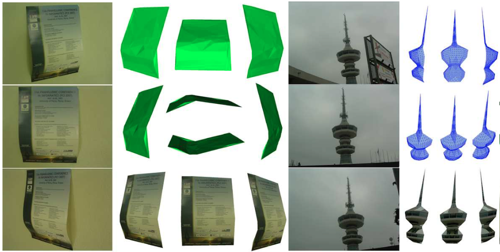

# py3DRec

This repository contains a revised implementation of the structure from motion algorithm used in [Barbalios et al., "3D Human Face Modelling From Uncalibrated Images Using Spline Based Deformation", VISSAP 2008](http://poseidon.csd.auth.gr/papers/PUBLISHED/CONFERENCE/pdf/VISAPP_final.pdf). Given at least three views of an object, and identified feature points across these views, the algorithm generates a 3D reconstruction of the object.


## Overview

The algorithm takes a series of features (i.e. 2D coordinates), tracked through a sequence of images (i.e. taken with a common handheld camera), and returns the 3D coordinates of these features in the metric space. To make this happen, the algorithm consists of the following steps: 
* Selecting two views (images), e.g. i-th and j-th view, the fundamental matrix and the epipoles are computed from the corresponding 2D features of the i-th and j-th view. For best results, the fartherst views in the sequence are selected.
* Estimating the projection matrices for the i-th and j-th view. To do so, the i-th view is assumed to be aligned with the world frame, and the projection matrix for the j-th view can be deduced using the fundamental matrix, the epipole and the reference frame of the reconstruction.
* Triangulation of the 2D features of the i-th and j-th views to get an initial estimate of the 3D point coordinates of the 2D features. 
* Estimating the projection matrices for all the remaining views, using the 3D points we got from triangulation.
* Bundle adjustment, i.e. an overall optimization to refine the 3D points and the projection matrices by minimizing the reprojection error of the 3D points back to each view. 
* Self-calibration to estimate the camera intrisic parameters for each view, and transform the 3D point coordinates from projective to metric space. 
* Delaunay triangulation of the 3D points, to get a 3D structure. 

Note: The algorithm used in the above referenced paper included an additional step, where the 3D points were used to deform a generic face model.



## Prerequisites 
The following python packages are required to run the projet: 
* [NumPy](http://www.numpy.org)
* [pandas](http://pandas.pydata.org) 
* [SciPy](https://www.scipy.org) 
* [numpy-stl](https://pypi.python.org/pypi/numpy-stl)
* [pillow](https://pillow.readthedocs.io/en/4.3.x/)


## Usage 
### Code Structure 

The code consists of four classes, each one designed for a specific task: 
* __ImageSequence:__ holds all the image sequence related stuff, like sequence length, width and height of each image, 2D feature coordinates across all images. It also contains a method (i.e. show()), to visualize the image sequence with the 2D features highlighted. 
* __EpipolarGeometry:__ implements epipolar geometry related operations, such as computing the fundamental matrix, finding the epipoles, triangulation, computing homographies, and the reprojection error for one or multiple views.
* __UncalibratedReconstruction:__ the main class that implements the 3D modeling algorithm. Constructor arguments include: 
  * _sequence length:_ the length of the image sequence
  * _width:_ the width of images in the sequence
  * _length:_ the length of the images in the sequence
  * _triang_method:_ triangulation method (0: standard triangulation, 1: polynomial triangulation)
  * _opt_triang:_ optimize triangulation result (i.e. 3D points)
  * _opt_f:_ optimize fundamental matrix estimation
  * _self_foc:_ for self-calibration, defines the type of focal length expected across views (0: fixed, 1: varying)
* __RecModel:__ holds the result of the reconstruction, i.e. projection matrices, rotation matrices, translation vectors, camera intrisic parameters vectors and the 3D structure point coordinates. It also contains a method, named export_stl_file, that performs Delaunay triangulation and saves the result in stl format. 

## Example
A toy-example is provided in the examples folder. It is a sequence of pictures of a poster on a wall (3 images). The 2D features were automatically selected using the SIFT algorithm, and are given in a txt file that has the following format: 
| x coordinated | y coordinates | feature id  | image id |.

To run the example, use the following command: 
```
python unalibrated_rec.py --input_file=./example/features_poster.txt --show
```
The first argument (i.e. --input_file) defines the txt file with the features, the second flag (--show) displays the image sequence together with the 2D features (remove this argument to not show the sequence). 

After the algorithm is executed, two files should be generated: 
* rec_model_cloud.txt : contains the 3D homogeneous coordinates of the reconstructed 3D model.
* reconstructed_model.stl: an stl file of the reconstructed 3D model


## License

This project is licensed under the MIT License - see the [LICENSE.md](LICENSE.md) file for details

